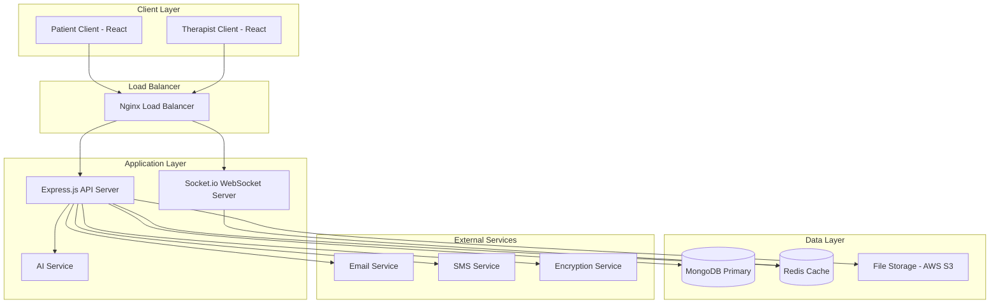

# Design Document: MindMend Mental Wellness Platform

## Overview

MindMend is a comprehensive full-stack mental wellness and teletherapy platform built using the MERN stack (MongoDB, Express.js, React.js, Node.js). The platform provides secure, HIPAA-compliant mental health services through two primary modules: a Patient Module for individuals seeking support and a Therapist Module for certified mental health professionals.

The architecture emphasizes security, scalability, and real-time communication while maintaining strict compliance with healthcare privacy regulations. The system supports mood tracking, appointment scheduling, secure messaging, resource libraries, community features, and AI-driven insights.

## Architecture

### High-Level Architecture



### Technology Stack

**Frontend:**
- React.js 18+ with functional components and hooks
- Tailwind CSS for responsive design
- React Router for client-side routing
- Axios for HTTP requests
- Socket.io-client for real-time communication
- React Query for state management and caching

**Backend:**
- Node.js with Express.js framework
- Socket.io for real-time WebSocket communication
- JWT for authentication and session management
- Bcrypt for password hashing
- Mongoose ODM for MongoDB interactions
- Multer for file upload handling

**Database:**
- MongoDB as primary database
- Redis for session storage and caching
- AWS S3 for secure file storage

**Security & Compliance:**
- HIPAA-compliant encryption (AES-256)
- TLS 1.3 for data in transit
- Role-based access control (RBAC)
- Audit logging for all data access

## Components and Interfaces

### Core Components

#### 1. Authentication Service
```typescript
interface AuthService {
  register(userData: UserRegistration): Promise<AuthResponse>
  login(credentials: LoginCredentials): Promise<AuthResponse>
  logout(token: string): Promise<void>
  refreshToken(refreshToken: string): Promise<AuthResponse>
  validateSession(token: string): Promise<UserSession>
}

interface UserRegistration {
  email: string
  password: string
  role: 'patient' | 'therapist'
  profile: PatientProfile | TherapistProfile
}

interface AuthResponse {
  accessToken: string
  refreshToken: string
  user: User
  expiresIn: number
}
```

#### 2. Patient Module
```typescript
interface PatientService {
  createProfile(profile: PatientProfile): Promise<Patient>
  updateProfile(id: string, updates: Partial<PatientProfile>): Promise<Patient>
  getMoodHistory(patientId: string, dateRange: DateRange): Promise<MoodEntry[]>
  logMoodEntry(entry: MoodEntryInput): Promise<MoodEntry>
  bookAppointment(appointmentData: AppointmentRequest): Promise<Appointment>
  getAppointments(patientId: string): Promise<Appointment[]>
}

interface MoodEntry {
  id: string
  patientId: string
  mood: number // 1-10 scale
  energy: number
  anxiety: number
  notes?: string
  timestamp: Date
  tags: string[]
}

interface PatientProfile {
  firstName: string
  lastName: string
  dateOfBirth: Date
  emergencyContact: ContactInfo
  medicalHistory: string[]
  currentMedications: string[]
  therapyGoals: string[]
  preferences: PatientPreferences
}
```

#### 3. Therapist Module
```typescript
interface TherapistService {
  getPatientList(therapistId: string): Promise<Patient[]>
  getPatientDetails(patientId: string): Promise<PatientDetails>
  createSessionNote(note: SessionNoteInput): Promise<SessionNote>
  getSessionHistory(patientId: string): Promise<SessionNote[]>
  updateAvailability(therapistId: string, availability: AvailabilitySlot[]): Promise<void>
  getDashboardMetrics(therapistId: string): Promise<TherapistMetrics>
}

interface SessionNote {
  id: string
  patientId: string
  therapistId: string
  sessionDate: Date
  duration: number
  notes: string
  assessments: Assessment[]
  nextSteps: string[]
  confidential: boolean
}

interface TherapistProfile {
  firstName: string
  lastName: string
  licenseNumber: string
  specializations: string[]
  education: Education[]
  experience: number
  bio: string
  availability: AvailabilitySlot[]
}
```

#### 4. Real-Time Communication System
```typescript
interface ChatService {
  sendMessage(message: MessageInput): Promise<Message>
  getConversationHistory(conversationId: string): Promise<Message[]>
  createConversation(participants: string[]): Promise<Conversation>
  markAsRead(messageId: string, userId: string): Promise<void>
  getUnreadCount(userId: string): Promise<number>
}

interface Message {
  id: string
  conversationId: string
  senderId: string
  content: string
  timestamp: Date
  messageType: 'text' | 'file' | 'system'
  encrypted: boolean
  readBy: ReadReceipt[]
}

interface WebSocketEvents {
  'message:new': (message: Message) => void
  'message:read': (messageId: string, userId: string) => void
  'user:online': (userId: string) => void
  'user:offline': (userId: string) => void
  'appointment:reminder': (appointment: Appointment) => void
}
```

#### 5. Appointment System
```typescript
interface AppointmentService {
  createAppointment(appointment: AppointmentInput): Promise<Appointment>
  updateAppointment(id: string, updates: Partial<AppointmentInput>): Promise<Appointment>
  cancelAppointment(id: string, reason: string): Promise<void>
  getAvailableSlots(therapistId: string, dateRange: DateRange): Promise<AvailabilitySlot[]>
  sendReminders(): Promise<void>
}

interface Appointment {
  id: string
  patientId: string
  therapistId: string
  scheduledTime: Date
  duration: number
  type: 'video' | 'phone' | 'in-person'
  status: 'scheduled' | 'completed' | 'cancelled' | 'no-show'
  notes?: string
  meetingLink?: string
}
```

#### 6. AI Insights Service
```typescript
interface AIService {
  generateMoodInsights(patientId: string): Promise<MoodInsights>
  analyzePatternTrends(moodData: MoodEntry[]): Promise<TrendAnalysis>
  generateRecommendations(patientProfile: Patient): Promise<Recommendation[]>
  detectRiskFactors(patientData: PatientData): Promise<RiskAssessment>
}

interface MoodInsights {
  overallTrend: 'improving' | 'stable' | 'declining'
  patterns: Pattern[]
  triggers: string[]
  recommendations: string[]
  confidenceScore: number
}

interface TrendAnalysis {
  timeframe: string
  moodAverage: number
  volatility: number
  significantEvents: Event[]
  correlations: Correlation[]
}
```

### API Endpoints

#### Authentication Endpoints
```
POST /api/auth/register
POST /api/auth/login
POST /api/auth/logout
POST /api/auth/refresh
GET  /api/auth/verify
```

#### Patient Endpoints
```
GET    /api/patients/profile
PUT    /api/patients/profile
POST   /api/patients/mood
GET    /api/patients/mood/history
GET    /api/patients/appointments
POST   /api/patients/appointments
GET    /api/patients/therapists
GET    /api/patients/insights
```

#### Therapist Endpoints
```
GET    /api/therapists/dashboard
GET    /api/therapists/patients
GET    /api/therapists/patients/:id
POST   /api/therapists/sessions/notes
GET    /api/therapists/sessions/:patientId
PUT    /api/therapists/availability
GET    /api/therapists/metrics
```

#### Communication Endpoints
```
GET    /api/chat/conversations
POST   /api/chat/conversations
GET    /api/chat/conversations/:id/messages
POST   /api/chat/messages
PUT    /api/chat/messages/:id/read
```

## Data Models

### User Schema
```javascript
const userSchema = new mongoose.Schema({
  email: { type: String, required: true, unique: true },
  passwordHash: { type: String, required: true },
  role: { type: String, enum: ['patient', 'therapist', 'admin'], required: true },
  isActive: { type: Boolean, default: true },
  lastLogin: Date,
  createdAt: { type: Date, default: Date.now },
  updatedAt: { type: Date, default: Date.now }
}, {
  timestamps: true,
  collection: 'users'
});
```

### Patient Schema
```javascript
const patientSchema = new mongoose.Schema({
  userId: { type: mongoose.Schema.Types.ObjectId, ref: 'User', required: true },
  profile: {
    firstName: { type: String, required: true },
    lastName: { type: String, required: true },
    dateOfBirth: Date,
    phone: String,
    emergencyContact: {
      name: String,
      phone: String,
      relationship: String
    }
  },
  medicalInfo: {
    conditions: [String],
    medications: [String],
    allergies: [String],
    therapyHistory: [String]
  },
  preferences: {
    communicationMethod: { type: String, enum: ['email', 'sms', 'both'] },
    reminderSettings: {
      appointments: Boolean,
      moodTracking: Boolean
    }
  },
  assignedTherapists: [{ type: mongoose.Schema.Types.ObjectId, ref: 'Therapist' }]
}, {
  timestamps: true,
  collection: 'patients'
});
```

### Therapist Schema
```javascript
const therapistSchema = new mongoose.Schema({
  userId: { type: mongoose.Schema.Types.ObjectId, ref: 'User', required: true },
  profile: {
    firstName: { type: String, required: true },
    lastName: { type: String, required: true },
    licenseNumber: { type: String, required: true, unique: true },
    specializations: [String],
    education: [{
      degree: String,
      institution: String,
      year: Number
    }],
    experience: Number,
    bio: String
  },
  availability: [{
    dayOfWeek: { type: Number, min: 0, max: 6 },
    startTime: String,
    endTime: String,
    timezone: String
  }],
  patients: [{ type: mongoose.Schema.Types.ObjectId, ref: 'Patient' }],
  isVerified: { type: Boolean, default: false }
}, {
  timestamps: true,
  collection: 'therapists'
});
```

### Mood Entry Schema
```javascript
const moodEntrySchema = new mongoose.Schema({
  patientId: { type: mongoose.Schema.Types.ObjectId, ref: 'Patient', required: true },
  date: { type: Date, required: true },
  mood: { type: Number, min: 1, max: 10, required: true },
  energy: { type: Number, min: 1, max: 10 },
  anxiety: { type: Number, min: 1, max: 10 },
  sleep: { type: Number, min: 0, max: 24 },
  notes: String,
  tags: [String],
  triggers: [String]
}, {
  timestamps: true,
  collection: 'mood_entries'
});

// Compound index for efficient queries
moodEntrySchema.index({ patientId: 1, date: -1 });
```

### Appointment Schema
```javascript
const appointmentSchema = new mongoose.Schema({
  patientId: { type: mongoose.Schema.Types.ObjectId, ref: 'Patient', required: true },
  therapistId: { type: mongoose.Schema.Types.ObjectId, ref: 'Therapist', required: true },
  scheduledTime: { type: Date, required: true },
  duration: { type: Number, default: 50 }, // minutes
  type: { type: String, enum: ['video', 'phone', 'in-person'], default: 'video' },
  status: { 
    type: String, 
    enum: ['scheduled', 'confirmed', 'completed', 'cancelled', 'no-show'], 
    default: 'scheduled' 
  },
  meetingLink: String,
  notes: String,
  remindersSent: [{
    type: { type: String, enum: ['24h', '1h', '15m'] },
    sentAt: Date
  }]
}, {
  timestamps: true,
  collection: 'appointments'
});
```

### Message Schema
```javascript
const messageSchema = new mongoose.Schema({
  conversationId: { type: mongoose.Schema.Types.ObjectId, ref: 'Conversation', required: true },
  senderId: { type: mongoose.Schema.Types.ObjectId, ref: 'User', required: true },
  content: { type: String, required: true },
  messageType: { type: String, enum: ['text', 'file', 'system'], default: 'text' },
  encrypted: { type: Boolean, default: true },
  readBy: [{
    userId: { type: mongoose.Schema.Types.ObjectId, ref: 'User' },
    readAt: Date
  }],
  editedAt: Date,
  deletedAt: Date
}, {
  timestamps: true,
  collection: 'messages'
});
```

### Session Note Schema
```javascript
const sessionNoteSchema = new mongoose.Schema({
  appointmentId: { type: mongoose.Schema.Types.ObjectId, ref: 'Appointment', required: true },
  therapistId: { type: mongoose.Schema.Types.ObjectId, ref: 'Therapist', required: true },
  patientId: { type: mongoose.Schema.Types.ObjectId, ref: 'Patient', required: true },
  sessionDate: { type: Date, required: true },
  duration: Number,
  notes: { type: String, required: true },
  assessments: [{
    type: String,
    score: Number,
    notes: String
  }],
  interventions: [String],
  homework: [String],
  nextSteps: [String],
  riskLevel: { type: String, enum: ['low', 'medium', 'high'], default: 'low' },
  confidentialityLevel: { type: String, enum: ['standard', 'restricted'], default: 'standard' }
}, {
  timestamps: true,
  collection: 'session_notes'
});
```

Now I need to use the prework tool to analyze the acceptance criteria before writing the Correctness Properties section:

<function_calls>
<invoke name="prework">
<parameter name="featureName">mindmend

## Correctness Properties

*A property is a characteristic or behavior that should hold true across all valid executions of a system—essentially, a formal statement about what the system should do. Properties serve as the bridge between human-readable specifications and machine-verifiable correctness guarantees.*

After analyzing the acceptance criteria, I've identified several properties that can be combined for more comprehensive testing. Many individual criteria test related aspects of the same underlying system behavior, so I've consolidated them into broader properties that capture the essential correctness requirements.

### Property Reflection

Several properties were identified as logically redundant or could be combined:
- Authentication properties 1.1, 1.2, 1.5, and 1.6 can be combined into comprehensive role-based access testing
- Profile management properties 2.1, 2.2, and 2.3 can be consolidated into profile lifecycle testing
- Chat system properties 6.1, 6.2, and 6.4 can be combined into comprehensive message delivery testing
- Security properties 11.1, 11.2, and 11.3 can be consolidated into comprehensive security testing

### Authentication and Authorization Properties

**Property 1: Role-based authentication and access control**
*For any* user with valid credentials and assigned role, authentication should grant access to exactly the features appropriate for that role and deny access to features outside their role permissions.
**Validates: Requirements 1.1, 1.2, 1.5, 1.6**

**Property 2: Invalid credential rejection**
*For any* invalid credential combination (wrong password, non-existent user, malformed input), the authentication system should deny access and provide appropriate error messaging without revealing sensitive information.
**Validates: Requirements 1.3**

**Property 3: Session expiration enforcement**
*For any* expired user session, the system should require re-authentication before allowing access to any protected resources.
**Validates: Requirements 1.4**

### Profile and Data Management Properties

**Property 4: Profile data lifecycle consistency**
*For any* patient profile operation (create, update, view), the system should maintain data consistency, validate inputs, and ensure only authorized users can access the information.
**Validates: Requirements 2.1, 2.2, 2.3, 2.5**

**Property 5: Privacy control enforcement**
*For any* sensitive patient information, the system should maintain appropriate privacy controls and prevent unauthorized access regardless of the access method attempted.
**Validates: Requirements 2.4**

### Mood Tracking Properties

**Property 6: Mood entry recording with metadata**
*For any* valid mood entry submission, the system should record the data with accurate timestamps, emotional metrics, and maintain data integrity.
**Validates: Requirements 3.1**

**Property 7: Mood analytics generation**
*For any* patient with mood data, the system should generate accurate trends, patterns, and statistical summaries when analytics are requested.
**Validates: Requirements 3.2, 3.3**

**Property 8: AI insight generation from patterns**
*For any* sufficient mood data set, the AI system should generate personalized insights and recommendations based on identifiable patterns in the data.
**Validates: Requirements 3.4**

**Property 9: Therapist mood data access with permissions**
*For any* therapist accessing patient mood data, the system should display comprehensive analytics only when proper authorization exists.
**Validates: Requirements 3.5**

### Appointment System Properties

**Property 10: Appointment availability and booking consistency**
*For any* appointment search and booking operation, the system should display accurate availability, prevent conflicts, and maintain consistency between patient and therapist schedules.
**Validates: Requirements 4.1, 4.2, 4.5**

**Property 11: Appointment lifecycle management**
*For any* appointment cancellation or modification, the system should update availability, maintain data consistency, and notify all relevant parties.
**Validates: Requirements 4.3**

**Property 12: Appointment reminder system**
*For any* scheduled appointment, the system should send timely reminder notifications to both patient and therapist according to configured schedules.
**Validates: Requirements 4.4**

### Therapist Module Properties

**Property 13: Therapist schedule and session management**
*For any* therapist accessing their module, the system should display accurate appointment information, provide session tools, and maintain proper patient record access controls.
**Validates: Requirements 5.1, 5.2, 5.4**

**Property 14: Session documentation and record keeping**
*For any* completed therapy session, the system should save session notes, update patient records, and maintain comprehensive treatment history.
**Validates: Requirements 5.3, 5.5**

### Communication System Properties

**Property 15: Real-time message delivery and history**
*For any* message sent between users, the system should deliver it in real-time to online recipients, store it for offline recipients, maintain conversation history, and provide proper threading.
**Validates: Requirements 6.1, 6.2, 6.4**

**Property 16: Message encryption and notifications**
*For any* message transmission, the system should encrypt the content and provide appropriate notification alerts to recipients.
**Validates: Requirements 6.3, 6.5**

### Resource and Community Properties

**Property 17: Resource library functionality**
*For any* resource library interaction, the system should provide proper categorization, search capabilities, engagement tracking, and personalized recommendations.
**Validates: Requirements 7.1, 7.2**

**Property 18: Resource notification and bookmarking**
*For any* new resource addition or user bookmarking action, the system should notify relevant users and allow proper organization of bookmarked content.
**Validates: Requirements 7.4, 7.5**

**Property 19: Community interaction and moderation**
*For any* community post or interaction, the system should enable proper publishing, commenting, reactions, threading, and content moderation while maintaining privacy controls.
**Validates: Requirements 8.1, 8.2, 8.3, 8.4, 8.5**

### AI and Analytics Properties

**Property 20: AI insight generation and presentation**
*For any* AI analysis request with sufficient data, the system should generate insights, respect privacy consent, and present results in understandable formats.
**Validates: Requirements 9.1, 9.2, 9.3, 9.4**

### Dashboard and Reporting Properties

**Property 21: Therapist dashboard and analytics**
*For any* therapist dashboard access, the system should display accurate patient metrics, appointment summaries, engagement statistics, and provide proper comparative analytics for caseload management.
**Validates: Requirements 10.1, 10.2, 10.4**

**Property 22: Clinical reporting and compliance**
*For any* report generation request, the system should create proper clinical documentation that meets insurance requirements while maintaining HIPAA compliance.
**Validates: Requirements 10.3, 10.5**

### Security and Infrastructure Properties

**Property 23: Comprehensive data security**
*For any* data operation (storage, transmission, access), the system should implement proper encryption, access controls, audit logging, and breach detection with appropriate notifications.
**Validates: Requirements 11.1, 11.2, 11.3, 11.4**

**Property 24: Regulatory compliance maintenance**
*For any* system operation involving personal health information, the system should maintain compliance with HIPAA, GDPR, and other relevant privacy regulations.
**Validates: Requirements 11.5**

**Property 25: Infrastructure scaling and performance**
*For any* increase in system load, the infrastructure should automatically scale resources while maintaining acceptable database response times.
**Validates: Requirements 12.1, 12.2**

**Property 26: Graceful degradation and monitoring**
*For any* system resource constraint, the platform should prioritize critical functions, gracefully degrade non-essential features, and provide proper monitoring and alerting.
**Validates: Requirements 12.4, 12.5**

## Error Handling

### Error Categories and Responses

#### Authentication Errors
- **Invalid Credentials**: Return 401 with generic error message to prevent user enumeration
- **Session Expired**: Return 401 with clear session expiration message
- **Insufficient Permissions**: Return 403 with role-specific guidance
- **Account Locked**: Return 423 with unlock instructions

#### Validation Errors
- **Invalid Input Data**: Return 400 with specific field validation errors
- **Missing Required Fields**: Return 400 with list of missing fields
- **Data Format Errors**: Return 400 with format requirements
- **Business Rule Violations**: Return 422 with rule explanation

#### System Errors
- **Database Connection**: Return 503 with retry guidance
- **External Service Failure**: Return 502 with fallback options
- **Rate Limiting**: Return 429 with retry-after header
- **Server Overload**: Return 503 with graceful degradation message

#### HIPAA Compliance Errors
- **Unauthorized Access Attempt**: Log security event, return 403, notify administrators
- **Data Breach Detection**: Immediate notification protocol, system lockdown procedures
- **Audit Log Failure**: Fail-safe mode, prevent data operations until logging restored

### Error Response Format
```json
{
  "error": {
    "code": "VALIDATION_ERROR",
    "message": "User-friendly error message",
    "details": {
      "field": "Specific field error",
      "timestamp": "2024-01-15T10:30:00Z",
      "requestId": "uuid-for-tracking"
    },
    "suggestions": ["Actionable steps for user"]
  }
}
```

### Logging and Monitoring
- **Error Tracking**: Comprehensive error logging with correlation IDs
- **Performance Monitoring**: Response time tracking and alerting
- **Security Monitoring**: Failed authentication attempts, suspicious activity
- **Health Checks**: Automated system health monitoring with alerts
- **Audit Trails**: HIPAA-compliant audit logging for all data access

## Testing Strategy

### Dual Testing Approach

The MindMend platform requires both unit testing and property-based testing to ensure comprehensive coverage and correctness:

**Unit Tests**: Focus on specific examples, edge cases, and integration points
- Authentication flows with specific credential combinations
- Database connection handling and error scenarios
- API endpoint responses for known inputs
- UI component behavior with specific user interactions
- Integration between React components and backend services

**Property-Based Tests**: Verify universal properties across all inputs
- Authentication and authorization properties across all user types and roles
- Data validation and storage properties for all possible input combinations
- Real-time communication properties across various network conditions
- Security and encryption properties for all data operations
- Performance and scalability properties under various load conditions

### Property-Based Testing Configuration

**Testing Framework**: Use `fast-check` for JavaScript/TypeScript property-based testing
- Minimum 100 iterations per property test to ensure comprehensive input coverage
- Custom generators for healthcare-specific data types (patient profiles, mood entries, appointments)
- Shrinking capabilities to find minimal failing examples when tests fail

**Test Organization**: Each correctness property maps to exactly one property-based test
- Tag format: **Feature: mindmend, Property {number}: {property_text}**
- Example: **Feature: mindmend, Property 1: Role-based authentication and access control**

**Data Generators**: Create realistic test data generators for:
- User profiles with various roles and permissions
- Mood entries with different emotional metrics and patterns
- Appointment schedules with various time zones and conflicts
- Messages with different content types and encryption states
- Medical recor